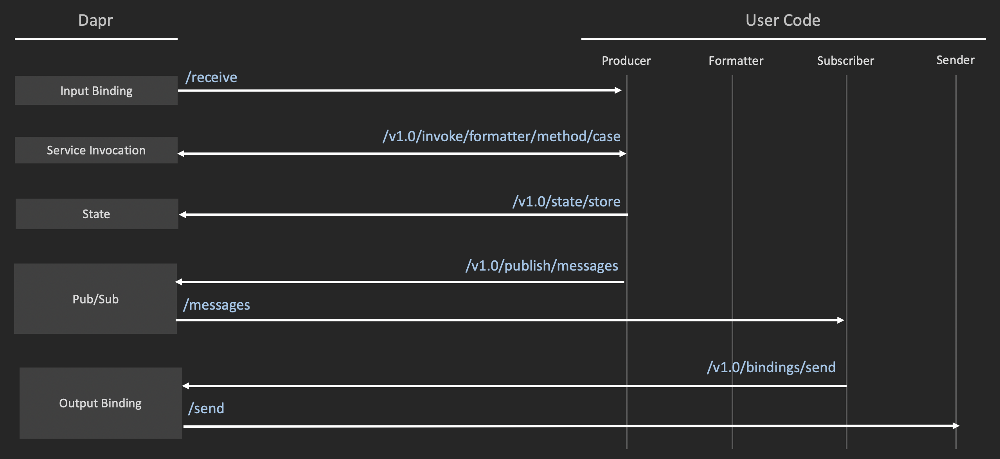

# dapr-tracing-demo

Dapr tracing demo integrating multiple self-container microservices (no dependencies) to illustrate end-to-end tracing where the tracing headers are being propagated across:

* service to service invocation 
* input binding
* state operation 
* pubsub subscribe 
* output binding  



## Prerequisites

* To run this demo locally, you will have to install [Dapr](https://github.com/dapr/docs/blob/master/getting-started/environment-setup.md).
* Additionally to view the resulting traces you will need Zipkin. Instructions on how to setup Zipkin for Dapr are [here](https://github.com/dapr/docs/blob/master/howto/diagnose-with-tracing/zipkin.md)

## Setup

Assuming you have all the prerequisites mentioned above, first, start by cloning this repo:

```shell
git clone https://github.com/mchmarny/dapr-tracing-demo.git
```

navigate into the `dapr-tracing-demo` directory

```shell
cd dapr-tracing-demo
```

and build the executables for your OS

```shell
bin/build
```

You should see now 4 files in the [dist](dist) directory: `producer`, `formatter`, `subscriber`, `sender`

## Run

Inside of the `dapr-tracing-demo` directory, start each one of the service individually:

### Formatter

```shell
dapr run dist/formatter \
     --app-id formatter \
     --app-port 8082 \
     --protocol http
```

### Subscriber

```shell
dapr run dist/subscriber \
     --app-id subscriber \
     --app-port 8083 \
     --protocol http
```

### Producer

```shell
dapr run dist/producer \
     --app-id producer \
     --app-port 8081 \
     --protocol http \
     --port 3500
```

### Sender

> Sender is not a Dapr service, it will serve as a target for output binding 

```shell
dist/sender
```

## Data

Now that all the services are running, send data by posting data to Dapr for the `receive` input binding

```shell
curl -X POST -d '{ "data": {"id":"1", "txt":"test"} }' \
     -H "Content-type: application/json" \
     "http://localhost:3500/v1.0/bindings/receive"
```


## Observability 

http://localhost:9411/zipkin/

> Note, if your Zipkin isn't deployed in the `default` namespace you will have to edit the `exporterAddress` in [deployment/tracing/zipkin.yaml](deployment/tracing/zipkin.yaml)


## Status 

### Service to service invocation 

**Status**: ✅
**Description**: Trace parent populated and trace state empty as expected

```shell
traceparent: 00-6b0b8b04cfbde34f867cc52e68eaefae-7d4e118a07a9b590-00
tracestate:
```

## Input binding

**Status**: ❌
**Description**: Expected trace parent to be populated and trace state empty

```shell
traceparent: 
tracestate:
```

## State operation 

**Status**: ❌
**Description**: Expected trace parent and trace state to be populated

```shell
traceparent: 
tracestate:
```

## Pubsub subscribe 

**Status**: ✅
**Description**: Expected trace parent and trace state to be populated

```shell
traceparent: 
tracestate:
```

## Output binding 

**Status**: ❌
**Description**: Expected trace parent and trace state to be populated

```shell
traceparent: 
tracestate:
```

## Disclaimer

This is my personal project and it does not represent my employer. I take no responsibility for issues caused by this code. I do my best to ensure that everything works, but if something goes wrong, my apologies is all you will get.

## License
This software is released under the [Apache v2 License](./LICENSE)


